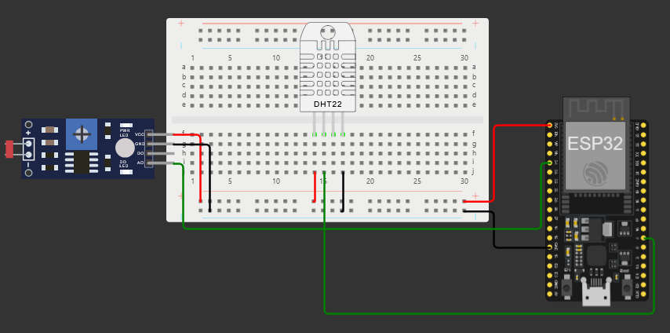
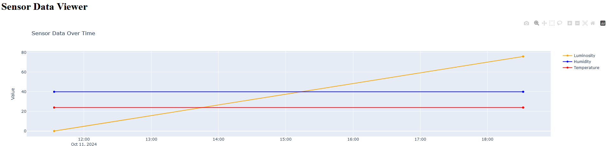

# Checkpoint 05 - O Caso da Vinheria Agnello - IoT Sensor Network for Vineyard Monitoring



## Project Description

This project focuses on the remote monitoring of luminosity, temperature, and humidity in vineyards using IoT technology. The system utilizes a **LDR sensor** to measure light intensity, along with a **DHT22 sensor** for temperature and humidity readings. The data collected by an **ESP32** device is transmitted to an MQTT broker, where the **FIWARE** ecosystem can manage the information and trigger actions based on real-time conditions.

## Objectives

The main goal of this project is to provide precise, real-time environmental data for vineyard management, enabling:

- **Light Monitoring**: Continuous monitoring of luminosity levels to optimize grape growth and harvesting schedules.
- **Environmental Control**: Tracking temperature and humidity to ensure optimal vineyard conditions.
- **Integration with FIWARE**: Sending data to the FIWARE platform for remote monitoring and action automation through the Postman API.

By following the [FIWARE simplified setup guide](https://github.com/fabiocabrini/fiware), users can integrate this project into their own IoT ecosystem for enhanced vineyard management.

### Simulated Prototype Access

[](https://wokwi.com/projects/https://wokwi.com/projects/408016150371922945)

### Project Demo Video

[](https://youtube.com/your-video-link)

## Required Resources

### Components Used

- **ESP32 DevKit v1** for data collection and transmission
- **LDR sensor** to measure luminosity
- **DHT22 sensor** for temperature and humidity readings
- **Connecting wires**

### Back-end

- **MQTT Broker** for message management
- **FIWARE Helix** to manage and monitor environmental data
- **Postman** API for testing and managing sensor data

### Front-end

- **Web dashboard** to visualize real-time data from the vineyard sensors
- **FIWARE Orion Context Broker** to trigger automated actions based on sensor data

## Python API for Sensor Dashboard

In addition to the sensor network, we developed a **Python API** that generates a real-time dashboard to visualize the data collected by the sensors. The API collects sensor readings from the **MQTT broker**, processes the data, and displays it on a web-based dashboard.



### Features of the API

- **Data Visualization**: The dashboard provides a real-time view of luminosity, temperature, and humidity data from the vineyard sensors.
- **Historical Data**: The API stores and allows access to historical data, enabling trend analysis over time.
- **Alert System**: Notifications are triggered based on thresholds (e.g., if luminosity drops below a certain level).

## FIWARE Integration

### This project utilizes the FIWARE Platform for back-end processing, including:

- Postman for testing and consuming the API.
- A Virtual Machine on Azure to host the FIWARE server, which manages the transmission and reception of luminosity, temperature, and humidity data.

## Features

- **Environmental Monitoring:** Continuous collection of light, temperature, and humidity data from the vineyard.
- **MQTT Publishing:** Sensor data is published to an MQTT broker, facilitating integration with FIWARE Helix.
- **Control via MQTT:** Actions can be triggered based on environmental data through FIWARE, such as adjusting vineyard conditions.

## How to Reproduce the Project

To reproduce this project, follow the detailed instructions in the FIWARE Guide by Professor Fábio Cabrini, which explains how to set up the FIWARE environment and integrate IoT devices with the MQTT broker and Helix.

### Required Libraries

The following libraries are required for the code to function:

- **WiFi.h:** For Wi-Fi connectivity.
- **PubSubClient.h:** For communication with the MQTT broker.
- **DHT.h:** For reading temperature and humidity data (DHT22).

## Development Platform

The project was developed using the Wokwi platform, which simulates the operation of the ESP32 and sensors.

## How to Use

1. Clone the repository:
   ```
   https://github.com/Cps-Tech-Sphere/CP5-EdgeComputing
   ```
2. Set up the FIWARE environment following the instructions in the Cabrini repository.
3. Configure the code with the correct Wi-Fi and MQTT credentials.
4. Upload the code to the ESP32 using the Wokwi platform or Arduino IDE.
5. Monitor vineyard data through the Serial Monitor or MQTT broker.

## Authors

<div style="display: flex; justify-content: space-between; align-items: center;">
<a href="https://github.com/jaoAprendiz" target="_blank" style="text-align: center; margin-right: 10px;">

<p style="font-size:min(2vh, 36px); margin-top: 10px;">João Victor - RM 557595</p>
</a>

<a href="https://github.com/K1rit03" target="_blank" style="text-align: center; margin-right: 10px;">

<p style="font-size:min(2vh, 36px); margin-top: 10px;">Thiago Oliveira - RM 555485</p>
</a>
</div>

<a href="https://github.com/JeannMatheuss" target="_blank" style="text-align: center; margin-right: 10px;">

<p style="font-size:min(2vh, 36px); margin-top: 10px;">Jean Matheus - RM 555519</p>
</a>


<a href="https://github.com/Malice112" target="_blank" style="text-align: center; margin-right: 10px;">

<p style="font-size:min(2vh, 36px); margin-top: 10px;">Maria Alice - 557516</p>
</a>


<a href="https://github.com/iannyrfs" target="_blank" style="text-align: center; margin-right: 10px;">

<p style="font-size:min(2vh, 36px); margin-top: 10px;">Ianny Raquel - 559096</p>
</a>
</div>

## License

This project is licensed under the MIT License.
